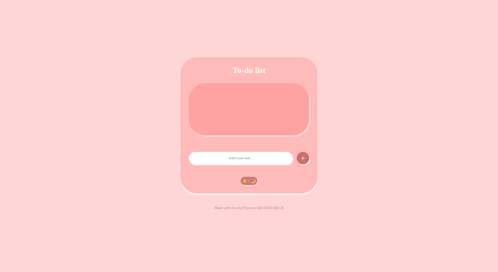
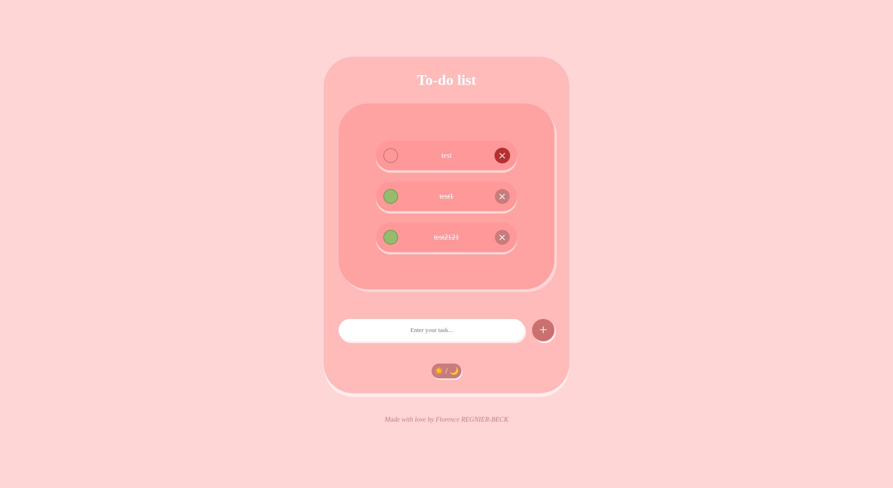

# 📝 To-Do App

Voici une application simple et esthétique, développée en **HTML**, **CSS** et **JavaScript**.

[Lien vers l'application](https://flo-rb.github.io/todo-app/)

## ✨ Fonctionnalités

- Ajouter des tâches à faire
- Marquer les tâches comme complètes
- Supprimer des tâches
- Interface responsive et minimaliste

## Langages utilisés

- **HTML5** : structure de la page
- **CSS3** : design et mise en page
- **JavaScript** : logique de l'application et interactions

## Ce qu'il me reste à faire

- [ ] Sauvegarde des tâches dans le stockage local
- [ ] Vider automatiquement le champ après ajout
- [ ] Ajout d’un mode nuit/jour

## Utilisation

- Ajoutez une tâche dans le champ prévu
- Cliquez sur le bouton "+" pour marquer la tâche comme complétée
- Cliquez sur la croix pour supprimer une tâche

Simple et efficace !

## 📸 Aperçu

**Voici l'interface de la todo-app, mêlant application fonctionnelle et esthétique**

Réalisé par Florence REGNIER-BECK

